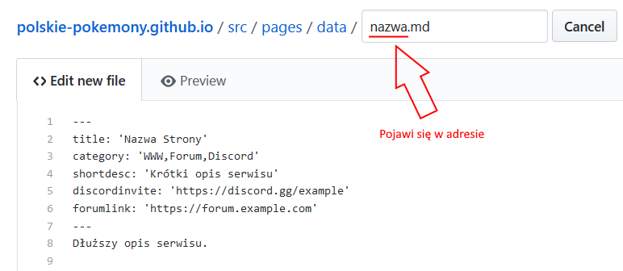
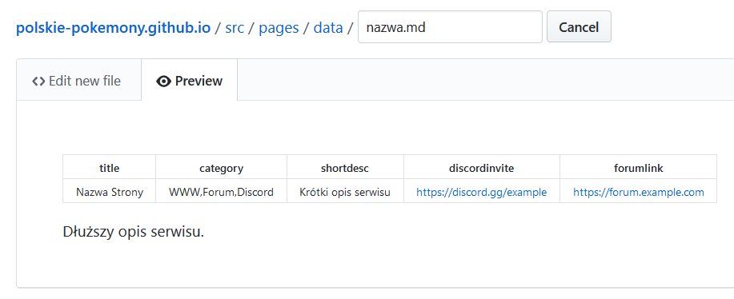
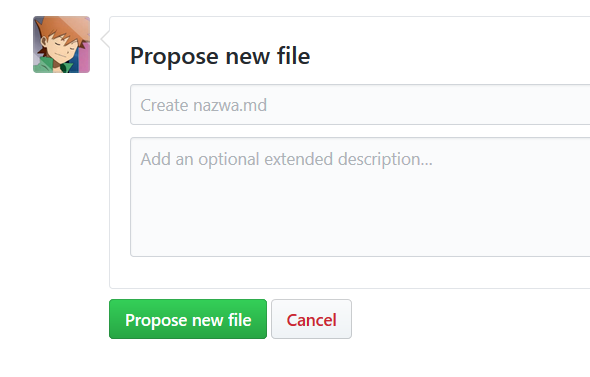
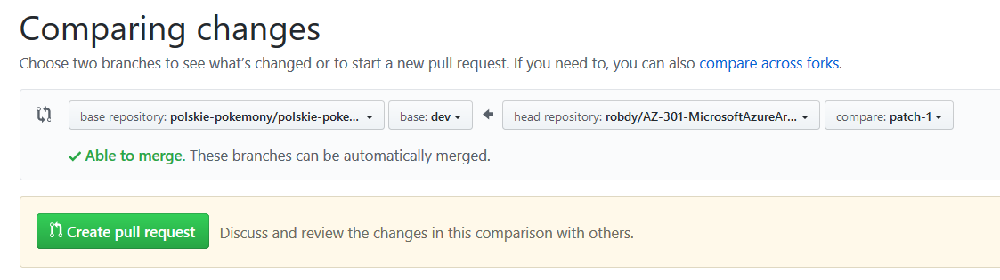
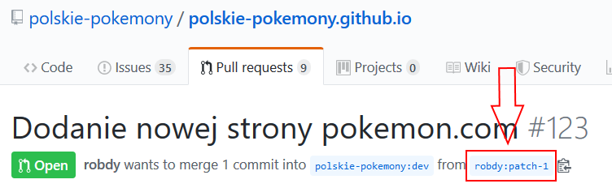

<h1 align="center">
  🎮 Polskie Pokémony 🎮
</h1>

Projekt powstał w celu zebrania informacji o miejscach w polskim internecie związanych z Pokémonami.

## ✅ Podsumowanie

Stronę możesz obejrzeć pod adresem https://polskie-pokemony.github.io.

Znalazłeś błąd? Chcesz coś zmienić/poprawić/dodać? Świetnie! Poniżej znajdziesz wszystkie potrzebne informacje i instrukcje.

## 💡 Chcę dodać nowe miejsce

Świetnie! 🎉 Mam dla Ciebie dwie możliwości:

### Wersja prostsza ✍️

Utworz `issue` do tego repozytorium, korzystając z [szablonu](https://github.com/polskie-pokemony/polskie-pokemony.github.io/issues/new?assignees=&labels=nowa-strona&template=dodanie-nowej-strony.md). Jeśli chcesz, możesz spróbować też dodać dane samodzielnie korzystają z poniższych kroków.

> ✅ Jeśli utworzyłeś issue, nie musisz robić nic więcej!

### Wersja dla nerdów 🤓

> Wybierz tą wersję, jeśli chcesz być dodany/a jako kontrybutor do projektu. Będzie to wymagało od Ciebie przejścia poniższej instrukcji:

1. **Dodanie pliku z informacjami**

    Utwórz (na swoim komputerze, w edytorze tekstów np. w Notatniku) plik z danymi strony według poniższego szablonu:

    ```
    ---
    title: 'Nazwa Strony'
    category: 'WWW,Forum,Discord'
    shortdesc: 'Krótki opis serwisu'
    discordinvite: 'https://discord.gg/example'
    forumlink: 'https://forum.example.com'
    ---
    Dłuższy opis serwisu.
    ```

    Szczegółowe informacje:
    * nazwa pliku powinna być w formacie `nazwa.md`. Będzie ona użyta do stworzenia adresu do wizytówki, w tym przypadku https://polskie-pokemony.github.io/nazwa/
    * nazwę pliku podasz później, podczas tworzenia pliku na Githubie
    * wartość z pola `shortdesc` będzie użyta w karcia na stronie głównej
    * w dłuższym opisie można używać [funkcji Markdown](https://guides.github.com/features/mastering-markdown/)
    * jeśli strona nie ma Discorda/forum/etc. - pamiętaj, żeby skasować odpowiednią kategorię i usunąć linię z odpowiednim polem np. `discordinvite` jeśli strona nie ma Discorda

1.  **Przygotowanie loga**

    Nazwa pliku z logiem powinna być `logo-nazwa.png`. Pamiętaj, że `nazwa` musi dokładnie zgadzać się z nazwą pliku `nazwa.md` utworzonego w punkcie powyżej.

1.  **Dodanie pliku z danymi**

    Wszystkie pliki z danymi powinny być umieszczone w folderze [`src/pages/data`](src/pages/data). Przejdź do tego folderu w repozytorium i kliknij `Create new file`. Zobaczysz okno jak poniżej:

    

    W kreatorze dodawania pliku, podaj nazwę w formacie `nazwa.md` (zgodnie z opisem w punkcie 1). W polu `Edit new file` wklej swoje dane. Następnie podejrzyj za pomocą `Preview changes`. Podgląd powinien mieć format jak poniżej:

    

    Następnie zjedź na dół i kliknij `Propose new file`:

    

    Na ekranie jak poniżej możesz sprawdzić swoje zmiany. Następnie kliknij `Create pull request`:

    
    
1.  **Wrzucenie loga**

    Aby dodać kolejne zmiany (w tym przypadku nowy plik), przejdź do swojego forka strony za pomocą linku jak poniżej:
    
    
    
    Na liście plików kliknij w folder `src` a następnie w `images`. W folderze w którym jesteś, użyj przycisku `Upload files` żeby dodać logo (pamiętej że nazwa powinna być `logo-nazwa.png`, jak opisane w punkcie 2).

1.  **Zobacz podgląd po zmianach**

    Wróć do swojego [pull requestu](pulls). Zjedź niżej i kliknij w `Details` obok `Deploy preview ready!`. Przejdziesz do zbudowanej wersji swojej strony. Sprawdź, czy wszystko jest OK i poczekaj na zatwierdzenie swoich zmian.
    
    To wszystko! 🎉🎉🎉

---

_Zbudowane w oparciu o framework [GatsbyJS](https://www.gatsbyjs.org)_
